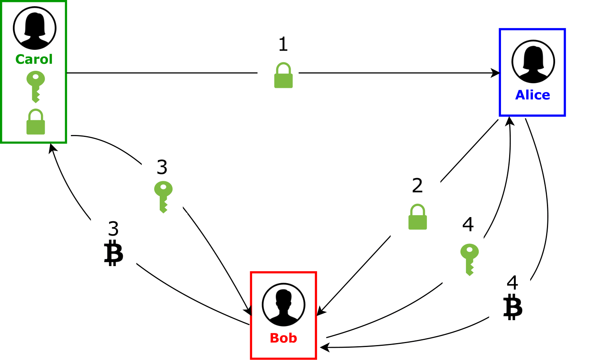

# Microtransactions with the Lightning Network
## Outline

Bitcoin is a decentralized payment system which allows anyone with an internet connection and a Bitcoin wallet to make transactions. But there are some major setbacks. Bitcoin implements transaction fees, which make micropayments too expensive. Bitcoin has also insufficient speed and a slow confirmation time to become a widely adopted payment system. The Lightning Network is a proposal of Joseph Poon and Thaddeus Dryja to address the scalability problem of Bitcoin by using off-blockchain techniques. The purpose of this article is to introduce and explain the idea behind the Lightning Network in simple terms.

<!-- START doctoc generated TOC please keep comment here to allow auto update -->
<!-- DON'T EDIT THIS SECTION, INSTEAD RE-RUN doctoc TO UPDATE -->
##Contents

- [Limitations of Bitcoin (as of December 2016)](#limitations-of-bitcoin-as-of-december-2016)
- [Motivation of the Lightning Network](#motivation-of-the-lightning-network)
- [Payment Channels](#payment-channels)
  - [Multisignature Address](#multisignature-address)
  - [Secrets and Hashes](#secrets-and-hashes)
  - [Time Locks](#time-locks)
- [Bidirectional Channel](#bidirectional-channel)
  - [Opening the Channel](#opening-the-channel)
  - [Updating the Channel](#updating-the-channel)
  - [Closing the Channel](#closing-the-channel)
  - [Fraud Prevention](#fraud-prevention)
- [Multiple Party Channel](#multiple-party-channel)
  - [Fraud Prevention](#fraud-prevention-1)
- [Summary](#summary)
  - [Scalability](#scalability)
  - [Costs](#costs)
  - [Use Cases](#use-cases)
- [Discussion](#discussion)
  - [Centralization](#centralization)
  - [Scaling Transactions, not Users](#scaling-transactions-not-users)
  - [Failure Mode](#failure-mode)

<!-- END doctoc generated TOC please keep comment here to allow auto update -->

## Limitations of Bitcoin (as of December 2016)
1. **Scalability**: Bitcoin is not scalable. Bitcoin can currently only process a theoretical maximum of 7 transactions per second (tps). But in real world conditions the maximum lies between 2 to 3 tps. In comparison to Paypal, they process almost 11.5 million transactions every single day. This results in a processing power of 133 tps. Also the Visa network processes an average of 150 million transactions every day. Which leads to an average of 1736 tps. This illustrates that Bitcoin must find a solution that is more scalable to serve a similarly sized customer base. 

2. **Transaction costs**: (Keep in mind that this calculation was done in Dezember 2016 and therefore, the costs are even higher right now!) Bitcoin is not suited for microtransactions. The transaction fees are too high. According to [New Service Finds Optimum Bitcoin Transaction Fee](https://www.coindesk.com/new-service-finds-optimum-bitcoin-transaction-fee/) the average size of a Bitcoin transaction is 645 bytes. The currently most popular fee ratio is CoinTape, they charge 41-50 satoshis per byte. This results in a 0.16 USD fee for every single transaction, which is clearly too high for a microtransaction.

3. **Confirmation time**: Confirmation time of a transaction is too long. It can vary greatly between 10-60 minutes. This is not suited for places where instant payments are required.

## Motivation of the Lightning Network
The Lightning Network addresses major flaws of Bitcoin:

1. **Scalability**: Since Bitcoin is not scalable due to its low transaction throughput, the Lightning Network uses payment channels to have less transactions on the blockchain. It uses smart contracts to guarantee the no trust policy. This allows the network to handle millions to billions of transactions per second. 

2. **Transaction costs**: With less transactions on the blockchain the transaction costs become a fraction of the original costs.

3. **Confirmation time**: The confirmation time of a transaction within a payment channel is nearly instant. As soon as a payment channel between to parties is opened they can exchange money within milliseconds.

## Payment Channels
There are several building blocks that need to be understood before diving into the Lightning Network. These building blocks are necessary to understand the fundamental element of the Lightning Network: a bidirectional payment channel.

### Multisignature Address
Multisignature addresses - or simply multisig - are shared Bitcoin addresses that require multiple signatures to spend bitcoins from. The Lightning Network mainly uses 2-of-2 multisigs. A 2-of-2 multisig is a shared Bitcoin address between two Bitcoin users where both must authorize (sign) every transaction. In general, any M-of-N multisig address up to 15 participants would be possible in the Bitcoin Network.

	

In this diagram Alice and Bob previously created a multisig address to which both hold a key. Alice wants to spend 5 bitcoins from this multisig back to her own address. Therefore, she creates and signs a transaction and passes it to Bob. If Bob agrees to this transaction, the transaction is valid and 5 bitcoins can be spent. If Bob does not agree, Alice will not be able to execute this payment. 

**Red color is used for Bob, blue color for Alice (and green color for Carol) throughout the entire paper.**

### Secrets and Hashes
A secret is a randomly generated string. As the name suggests, a secret should ideally not be easy to guess. Accordingly, it has to be fairly large and complex. A cryptographic hash function is a mathematical one-way algorithm, that takes a string (in this case the secret) as an input and computes it into a hash, a unique string of numbers. The essential property of this concept is, that someone who knows the secret can easily recreate the hash, but the secret cannot be reproduced from the hash. In the Figure below a transaction is illustrated that is using secrets and hashes. Colored hashes and secrets indicate to what person the hash or secret belongs to. 

	

### Time Locks
A time lock delays the execution of a transaction from a specific address. More precisely: the signature of a user on this address for a specific transaction becomes valid only after that time lock expires. 
There are two types of time locks: an absolute and a relative type.

* The relative type is called a CheckSequenceVerify (CSV), it refers to an event, rather than a specific point in time. That event would be a specific number of blocks added onto the blockchain.

* The absolute type is called a CheckLockTimeVerify (CLTV), it refers to an actual time and date. With this type of lock one can create a hash time locked contract (HTLC) as in the Figure below illustrated. Alice makes a transaction to a new multisig address. Alice wants to be sure that Bob can only unlock this multisig if he provides the secret from another transaction (green key). She also wants to make sure that she gets her bitcoin back if Bob does not corporate. That is why the CLTV lock is needed. 

	

## Bidirectional Payment Channel
The idea of payment channels has been around for a while, but only with limited use. They are one-directional. Alice can pay Bob through several off-chain transactions, but Bob can't pay Alice at all. To solve this problem, the concept of a bi-directional channels was created. This bi-directional channel is realized with a 2-of-2 multisig address.

### Opening the Channel
Consider the following scenario: Alice wants to send 1 BTC to Bob. Since they both expect to exchange funds regularly, they decide to open a payment channel.

To setup a bi-directional channel, Alice and Bob have to both first agree on an opening transaction, which specifies how many bitcoins each deposits into the channel/multisig address. In this example they both deposit 5 bitcoins into a 2-of-2 multisig address. This is the **opening transaction**.

Now Alice and Bob both generate a secret and the corresponding hash. Alice now creates a **commitment transaction**. In this transaction, Alice would send 4 bitcoins to herself, and 6 bitcoins to a separate 2-of-2 multisig address. Alice signs this transaction and gives it to Bob. Bob does the same as Alice but mirrored: He also creates a commitment transaction, where he sends 6 bitcoins to himself and 4 bitcoins to a separate multisig address. He signs this transaction and gives it to Alice.

These commitment transactions serve similarly to a contract: They are a trustless assurance that the owner possesses his/her fair share of the multisig address.

Alice and Bob both sign their opening transactions and broadcast it onto the blockchain. The channel is now open. At this point, both have the option to sign and broadcast the commitment transaction and thereby close the channel. But the whole trick is that neither of them signs and broadcasts the commitment transaction. The channel stays open and can be used for further transactions between them. In the Figure below the just described scenario is illustrated.

### Updating the Channel
Since a bi-directional payment channel is now already established, things get easier. In the next scenario, Bob wants to pay Alice 0.5 bitcoins back. To do this, they both exchange the secrets from the previous transaction which effectively invalidates it.

Afterwards, they generate a new secret and again exchange half-signed commitment transactions: Bob creates a commitment transaction where he immediately gets 5.5 bitcoins and 4.5 bitcoins go into a 2-of-2 multisig (same setup as before). Alice does the same but mirrored. For every new transaction, this process will be repeated. The updated transaction is shown in the Figure below.

### Closing the Channel
If both parties want to peacefully close a channel they can both sign a new transaction, that gives them their fair share of the multisig. Everybody will get their amount of bitcoins immediately after it has been added to the blockchain. Every previous transaction in the channel can be discarded.
            
The channel will also be closed in case either Alice or Bob decides to broadcast their commitment transaction.
            
One can see in the examples above, Alice or Bob simply needs to unlock the half-signed transaction they received in order to broadcast a transaction. So Bob could sign the transaction, that he has received and that has already been signed from Alice. He then broadcasts this transaction. Alice receives her bitcoins immediately (will be included on the blockchain as soon as possible). Bob needs to wait for the required time lock, then his transaction will also be added to the blockchain. The channel is now closed.
            
If Bob broadcasts an old transaction, Alice could with Bob's private key to this transaction also get Bob's money. In this scenario, there is no time lock restriction. Alice receives the all the money from the multisig right away and the channel is closed. 

### Fraud Prevention
Bob had 6 bitcoins in the first transaction and only 5.5 bitcoins in the second. What prevents him from not cooperating and insisting on the first transaction?

If Bob decides to sign the first commitment transaction Alice gave him, Alice gets 4 bitcoins immediately. The second transaction is from the multisig to Bob's account - but there's a time lock of 1000 blocks on it. Since Alice's transaction got included in the blockchain and she received her 4 bitcoins, she knows that Bob tried to broadcast an old transaction. Bob's transaction is delayed and Alice can now use Bob's previously exchanged secret to receive his funds immediately. Alice has now all the money from the channel and the channel is closed.

## Multiple Party Channel

Alice and Bob already have an open channel and Bob and Carol have an open channel. What happens if Alice wants to send Carol some bitcoins?

Using smart contracts, it is possible to send bitcoins from Alice to Carol via Bob, without having trust issues.
            
The following scenario is visualized in the Figure below. To initiate the payment, Alice tells Carol to create a secret. Carol sends the hash to Alice and Alice (1) forwards it to Bob (2). Now Bob pays Carol 1 bitcoin and gets the secret to the hash in exchange (3). Seeing Bob having the secret, Alice can be assured that Bob paid 1 bitcoin to Carol. Alice now pays Bob 1 bitcoin and gets the secret in exchange (4). The payment is now successfully completed.

	

The problem with this approach is, that there's still trust involved: How can Bob be sure that Carol gives him the secret after sending 1 bitcoin?

This is where CTLV-time locks come in: Instead of just giving 1 bitcoin back, the bitcoin is deposited into a 2-of-2 multisig which can be unlocked either with the secret or after a certain period of time.

Carol provided Alice with the corresponding hash to her new secret. Since Alice will pay Carol through already existing channels, she will use her channel with Bob as an intermediate. Therefore, she provides Bob with Carol's hash, updating their payment channel with a new commitment. But in this new commitment, Alice will separate a bitcoin, which is her payment to Carol. This bitcoin is locked up with Carol's hash. Bob will only be able to get this bitcoin with Carol's corresponding secret. To get this secret from Carol, he sends Carol an update request of their payment channel. Bob now creates a commitment on their payment channel with Carol, where he also locks up a bitcoin, Alice's payment for Carol. Carol can unlock this with her corresponding secret. So she sends her secret to Bob to get her bitcoin. Bob forwards this secret to Alice to get his bitcoin.

Since Carol sent Alice the hash, she is actively listening for an update request from any source. Bob is acting as a middle man since he received Carol's hash from Alice. Therefore, he sends Carol an update request. In this update, Bob separates or locks up a bitcoin, which represents Alice's debt to Carol. This separated bitcoin can be unlocked if Carol provides the correct secret to Bob. In the previous Figure a complete overview with all possible failsafes is shown. 

### Fraud Prevention
The mechanism to prevent non-cooperation is very similar to before with direct bi-directional channels. Additionally to give Bob additional security the time lock for the multisig with Carol will always run out before the time lock of his multisig with Alice. This prevents the situation where he pays Carol 1 bitcoin and getting the secret but being unable to get the bitcoin back from Alice.

## Summary
### Scalability

As previously discussed, the Bitcoin network has scalability issues. It is therefore not suited to be used by the masses as for example Paypal or Visa. The Lightning Network tries to overcome those obstacles. It takes most of the transactions off the blockchain without loosing its trust policy. The transactions will be stored locally in the nodes. The Lightning Network only uses the blockchain for opening and eventually closing a payment channel.

### Costs   
In a perfect world, payment channels do not have to be closed at all, and the transaction fees in the Lightning Network are effectively zero. This makes the Lightning Network so attractive. Since almost all transaction are kept off-chain, almost no costs are generated. If a channel has to be closed for some reason, only the newest commitment transactions have to be considered — all the previous transactions can be discarded.

### Use Cases
The Lightning Network requires no mining of transactions within the payment channel. Therefore, transactions can be considered instantaneous, they are valid as soon as the channel is updated with another transaction.

The low transaction fees and the instant confirmation opens possiblities for many usecases:

*  One can pay for a cup of coffee at Starbucks instantaneously, without people in the long line getting mad at confirmation waiting.

* The hassle for content creators to get paid online would decrease dramatically. Publishers could get paid instantly for showing ads on their websites. Youtube could pay content creators in real-time according to views. 

* One could bypass ads for a small amount, which is paid instantly. You could also get paid to watch ads if you're willing to watch them.

## Discussion

### Centralization

There is some discussion about centralization risks that lead to potential super-nodes. There are several aspects that speak for and against a potential centralization. On one hand, one can make money when one route payments from one node to another. Also, one has some interesting data at hand, that could potentially be analyzed and sold to marketing firms. These are both incentives for building well-connected nodes.

### Scaling Transactions, not Users

Although the Lightning Network seems to be one of the best solutions to scale the Bitcoin Network, it only prevents transactions from entering the Blockchain and does nothing directly to scale to more users. The Lightning Network still requires on-chain transactions to open and close channels, which is limited by the maximum block size of Bitcoin. The Network will certainly help scale Bitcoin, but it would just delay the maximum block size discussion, which has to be solved eventually.

### Failure Mode
When there isa big number of contracts that need to be settled at the same time, there is a potential failure. There is only a limited amount of data that can be stored to the blockchain. If there is a large number of channels, that close out rapidly. This means that the transaction costs could rise substantially.